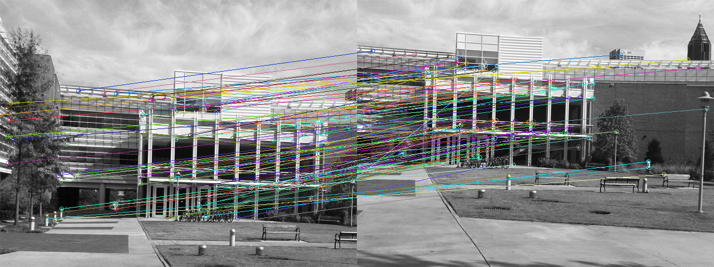
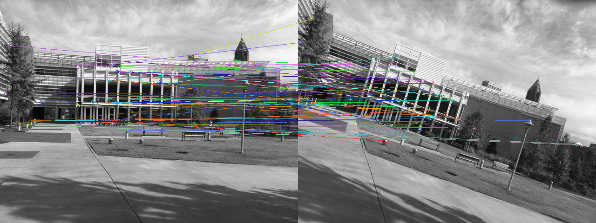

# CV-FeatureCreationAndMatching
Finds and draws corners in a given image using Harris response map.
Creates OpenCV KeyPoint objects given interest points, response map, and angle images.
Matching harris corners from in multiple images with RANSAC consencus drawing. 

